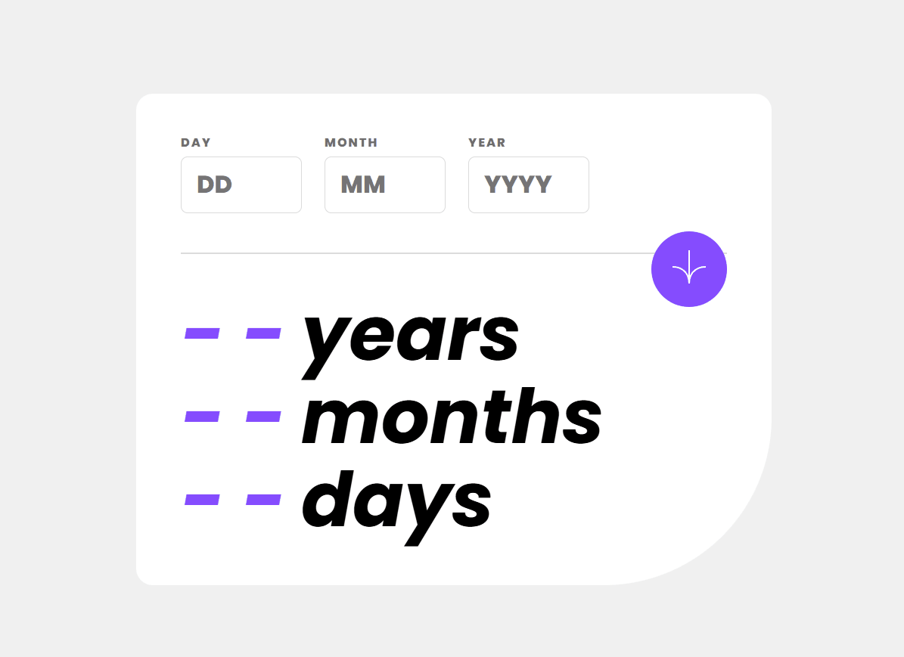

# Age calculator app

This is a solution to the [Age calculator app challenge on Frontend Mentor](https://www.frontendmentor.io/challenges/age-calculator-app-dF9DFFpj-Q)

## [View the project here](https://itsdavss.github.io/age-calculator-app/) ##

## Glossary

- [Overview](#overview)
  - [About](#about)
  - [Screenshots](#screenshots)
- [My process](#my-process)
  - [Challenges and learnings](#challenges-and-learnings)
  - [Developed with](#developed-with)
- [Autor](#autor)

## Overview

### About

The purpose of the website is to calculate the user's age based on their date of birth and display errors if the form is filled out incorrectly, such as:

- Any field is empty when the form is submitted
- The day number is not between 1-31
- The month number is not between 1-12
- The date is in the future
- The date is invalid, e.g., 31/04/1991 (April has only 30 days)
- View the optimal layout for the interface depending on their device's screen size
- See hover and focus states for all interactive elements on the page

### Screenshots

#### Example of the website

## My process

### Challenges and learnings

Overall, the development of this app was quite smooth. I believe my only challenge was calculating the dates, which can be quite tricky at times. I refactored the code to get used to refactoring after completing all the logic, and without a doubt, this will greatly enhance my skills as a developer. I also made the website responsive so it can be used on mobile devices and to practice my responsiveness skills

### Developed with

- HTML
- Responsive CSS
- Flexbox
- Javascript

## Autor

- GitHub - [itsdavss](https://github.com/itsdavss)
- My portfolio - [Davi Oliveira](https://itsdavss.github.io/portfolio-davi/)
- LinkedIn - [Davi Oliveira dos Santos](https://www.linkedin.com/in/davi-oliveira-dos-santos/)
